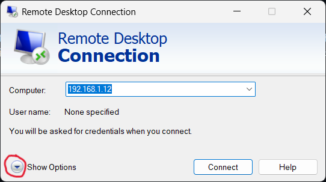
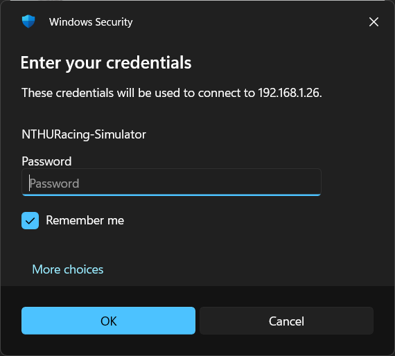

# Workshop PC: Remote Access & Management 🖥️

這是一個關於如何管理與遠端連接工廠電腦的説明頁面。為了讓大家能順利使用工廠資源，請務必詳讀以下規則。

## !!Rules to know!! ⚠️

工廠目前有兩臺由 **生麗國際** 贊助的電腦供大家使用。由於辦公位子有限，我們開放讓大家可以遠端使用這些電腦。

在使用工廠電腦前，請嚴格遵守以下事項：

1.  **Public Computer Protocol:**
     顧名思義這是工廠電腦，是公共的電腦。你可以用作私人用途，但請確保使用完後把你不要的資料都刪除。需要的文件請轉移到 Google Drive，或是這兩臺電腦都配有 **HDD**，可以作爲長期存儲文件的位置。

2.  **Keep it Clean:**
     公用電腦請保持整潔，不要留一堆文件在 **Downloads**, **Documents** 或 Desktop，這會讓電腦堆積很多沒用到的垃圾文件。尤其是 App 的安裝包，請在安裝後刪除。
    > **注意：** 如果我看到還有零散的文件留在 Downloads 和 Documents，我會**直接刪除**。之前有很多不好的經驗，希望不會重蹈覆轍。

3.  **Session Management:**
     使用完後請確保你的視窗都全部關閉，不要開一堆視窗和 App 都不關。後來的人在使用時，若需要重啓電腦，會不知道到底能不能重啓、能不能關閉那些殘留的視窗和 App。
    > **重要：** 如果有需要放著讓程式跑或者跑模擬 (Simulation) 的情況，請務必在對應的 **Workshop Workstation: Remote Usage & Rules** Team Affair 中通知，以免有人關掉你辛苦的結晶。

---

## How to Connect (Remote Access) 🚀

以下提供兩種無線使用工廠電腦的方式：

### 1. 在工廠連接 S11 Wifi

使用 Windows 內建的 **Remote Desktop Connection**（遠程桌面連接），並輸入以下對應的 IP。

#### 連接步驟 (Step-by-Step)：

* **步驟一：** 開啟 Remote Desktop Connection，點擊左下角 **Show Options**。

* **步驟二：** 輸入電腦 IP 以及 Username，點擊 **Allow me to save credentials**。

* **步驟三：** 跳出輸入密碼畫面時，兩臺電腦的密碼皆為 **清大統編**。可以勾選 **Remember me** 就不用重複輸入，然後點擊 **OK**。

* **步驟四：** 會跳出 Warning 問你是否真的要遠端遙控此電腦，勾選左下角的 **"Don't ask me again for connections to this computer"** 後按下 **Yes/OK** 即可連線。

#### 電腦資料 (PC Details)：

| 位置 | 一樓辦公桌上的電腦 | 模擬器電腦（暫置二樓） |
| :--- | :--- | :--- |
| **IP Address** | `192.168.1.69` | `192.168.1.26` |
| **Username** | `ASUS` | `NTHURacing-Simulator` |

### 2. VPN 連接（Non-S11 Wifi）

* 考慮到 Security 問題，若需要從外部網絡連接，請私訊我 (DM me)。
* 説明原因後，我才會開通你的 **VPN 權限**。
